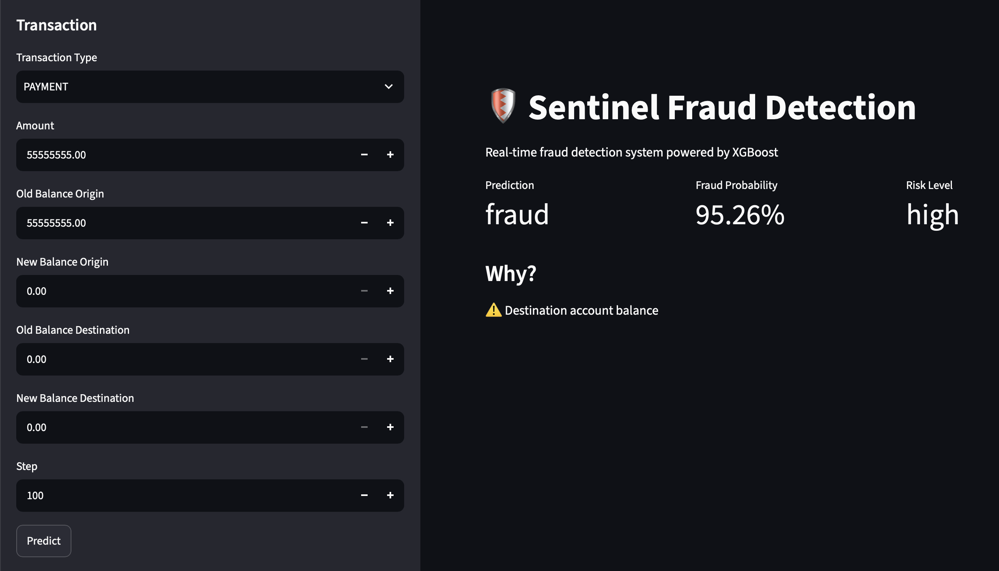

# Sentinel

> An end-to-end fraud detection platform for detecting fraudulent financial transactions using machine learning.

     [](https://github.com/MiladGolchinpour/sentinel-fraud-platform/actions/workflows/ci.yml)

Sentinel is a production-oriented machine learning system for real-time fraud detection. The project includes data preprocessing, feature engineering, model training, SHAP-based explainability, a REST API built with FastAPI, an interactive Streamlit dashboard, automated testing, and Dockerized deployment.

## Features

- End-to-end machine learning pipeline
- Automated feature engineering
- XGBoost fraud detection model
- SHAP-based prediction explanations
- FastAPI REST API
- Interactive Streamlit dashboard
- Dockerized deployment
- Automated testing with Pytest

## Live Demo

- Dashboard: https://sentinel-dashboard-8586.onrender.com (Inactive now due to Render limitations)
- API: https://sentinel-api-ad1r.onrender.com/docs (Inactive now due to Render limitations)

## Architecture

```text
Transaction
    │
    ▼
Validation → Feature Engineering → Preprocessing → XGBoost Model → Fraud Probability
                                                                  ├── SHAP Explainability
                                                                  └── FastAPI → Streamlit Dashboard
```

## Project Structure

```text
Sentinel/
├── dashboard/         # Streamlit dashboard
├── data/              # Dataset (ignored by Git)
├── models/            # Trained model and artifacts
├── notebooks/         # EDA
├── src/               # Training, API and ML pipeline
├── tests/             # Unit tests
├── docs/              # Images and stuff
├── .github/           # GitHub Actions - CI
├── docker-compose.yml
├── Dockerfile.api
├── requirements.txt
└── README.md
```

## Getting Started

### Clone the repository

```bash
git clone https://github.com/MiladGolchinpour/sentinel-fraud-platform.git
cd sentinel-fraud-platform
```

### Option 1 — Run manually

Create a virtual environment and install dependencies:

```bash
python -m venv .venv
source .venv/bin/activate      # Linux / macOS
# .venv\Scripts\activate       # Windows

pip install -r requirements.txt
```

Start the API:

```bash
uvicorn src.api:app --reload
```

Start the dashboard:

```bash
streamlit run dashboard/Predictor.py
```

API documentation: `http://localhost:8000/docs`

### Option 2 — Run with Docker

```bash
docker compose up --build
```

This starts both the FastAPI service and the Streamlit dashboard.

---

### Dataset

This project uses the [PaySim financial transactions dataset](https://www.kaggle.com/datasets/mtalaltariq/paysim-data).

The dataset is **not included** in this repository due to its size.

For manual training, download the dataset and place it in:

```text
data/raw/paysim.csv
```

Then train the model:

```bash
python -m src.training
```

---

### Example Request

```json
{
  "type": "TRANSFER",
  "amount": 500000,
  "oldbalanceOrg": 500000,
  "newbalanceOrig": 0,
  "oldbalanceDest": 0,
  "newbalanceDest": 500000,
  "step": 100
}
```

### Response

```json
{
  "prediction": "fraud",
  "fraud_probability": 0.96,
  "risk_level": "high",
  "top_reasons": [
    "Transfer transaction"
  ]
}
```

## Dashboard

The Streamlit dashboard provides:

- Real-time fraud prediction
- SHAP-based prediction explanations
- Model performance metrics
- Interactive data exploration

<p align="center">
  
</p>

## Testing

Run the test suite with:

```bash
pytest
```

## Future Work

- Model monitoring and data drift detection
- Hyperparameter optimization
- Support for additional ML models

## License

MIT
